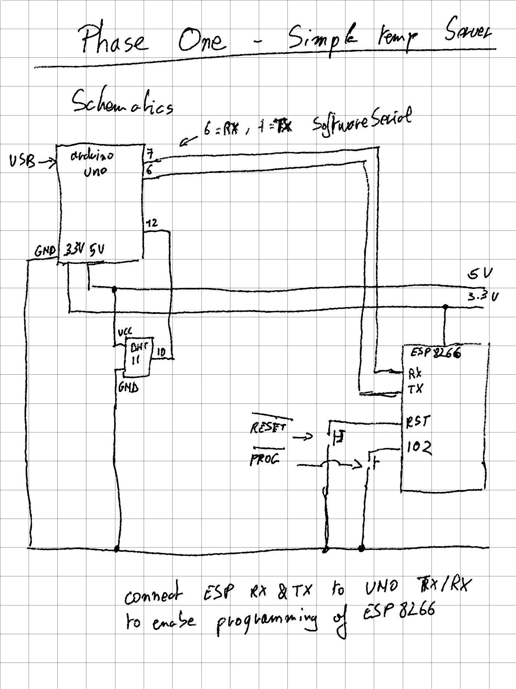
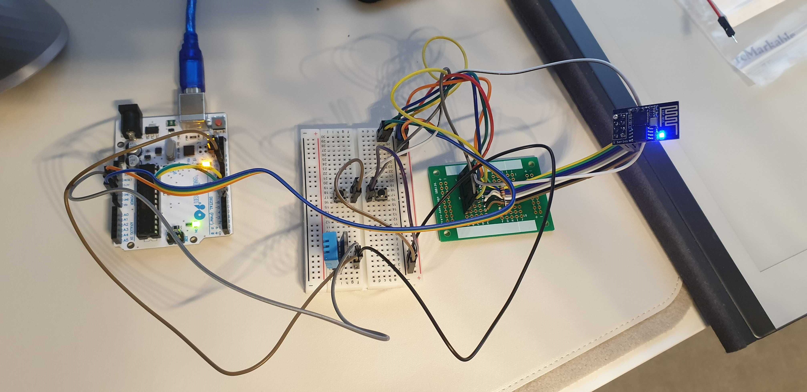

# Doing weather stuff with Arduino: Phase One

In this phase I'm trying to connect to make a wifi-webserver showing the local measured temperature.

## Hardware

This is the hardware layout of the first test phase. 



And a nice picture of how it's wired:



## Software

The ESP8266 can only communicate via serial connection. That is why it's important to make some
rules regarding this communication. Each communication starts with a header of 9 characters long, 
followed by a space and the data itself. This data can be text or another data type.

### Serial Communication Rules

| Direction | Header    | DataType | Info  |
|-----------|-----------|----------|-------|
| ESP->UNO  | WIFISTATE | String   | State of the Wifi 
| ESP->UNO  | WIFIADDRS | String   | Ip Address of the server 
| ESP->UNO  | CLIENTSRV | String   | The ip of a web client that has been served
| UNO->ESP  | TEMPINCEL | Float    | The current measured temperature

### Programming the ESP8266

- To program the ESP8266, please connect the TX and RX of the ESP to the TX(pin 1) and RX(pin 0) of the 
  UNO. After that you should press the program button, and keep holding it while you short press the reset
  button. Release the program button only after releasing the reset button.
- It's also very important that there is no software running on the arduino UNO. Please load the 
  BareMinimum example onto the UNO.
- In the Arduino software, add `https://arduino.esp8266.com/stable/package_esp8266com_index.json` to the
  Additional Board Management URL's so that the ESP8266 Boards come available in the menu.
- Select the General ESP8266 board with all it's defaults and you're good to go.
- In my experience, it's possible the connection is unstable, keep resetting with the program button until
  it works

### ESP8266 Software

This software can be found [here](esp8266/esp8266.ino). It is the web server that will host the HTML pages showing the current temperature. The wifi SSID and password are stored in arduinosecrets.h (not included). You should create that file with following content:

```c++
#define SECRET_SSID "foo"
#define SECRET_PASS "bar"
```
